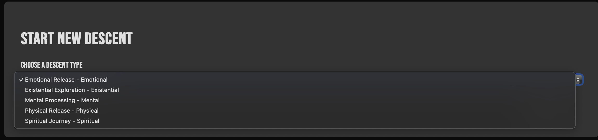
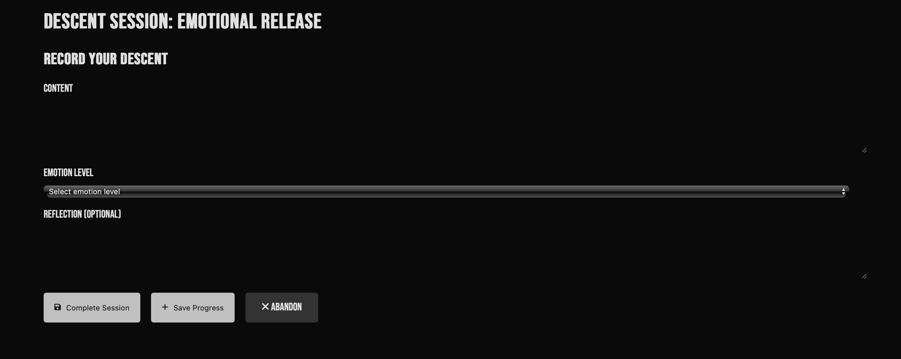
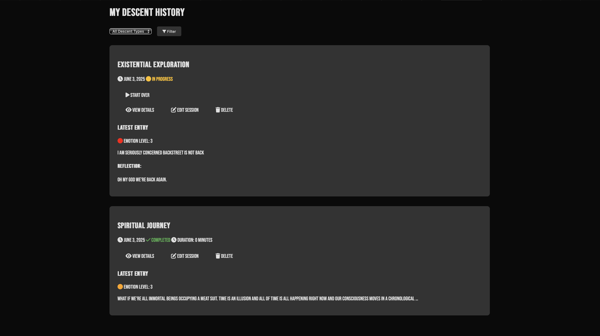
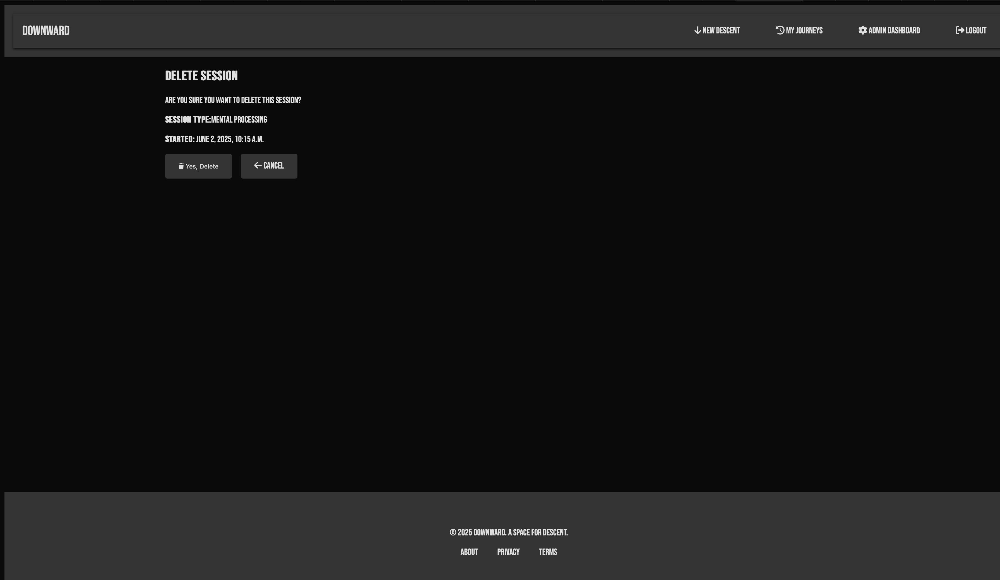

# Downward - A Digital Descent Journal

A Provide space for exploring emotional descents and personal reflections. Downward provides a structured yet flexible platform for users to document and analze their emotional journeys.

## Features
- **Descent Types**: Multiple guided descent types for different emotional explorations
- **Journaling**: Rich text journal entries with emotion tracking.
- **Reflection**: Structured reflection prompts for deeper understanding
- **Responsive Design**: Fully mobile-friendly interface
- **Privacy**: Secure, private journaling environment.
- **Mobile Navigation**: Smooth mobile experience with toggle menu

## Tech Stack

- **Backend**: Django 5.2.1
- **Frontend**: HTML5, CSS3, Javescript
- **Database**: PostgreSQL
- **Authentication**: Django Auth
- **Icons**: Font Awesome

## Getting Started

### Home page
 The user lands on a homepage that immediately allows them to understand the purpose of the website. There is a call to action button inviting the user to "Begin your Descent".
 If the user is not logged in they will be redirected to the login page where they can log in or register for an account. 
 

### Login/Register page
The login page provides a login form where the user is asked to input their username and password.

 It also offers the user a chance to register for an account if they do not have an account yet.
 

 The register page asks the user to input a username, email address and password once they register they are redirected back to the homepage to begin their journey. 

 ### New Descent page
The new descent page provides the user with a list of different descent types to choose from and a button to begin their descent session. 

### Journaling page
Upon beginning their descent the user is brought to the descent page where the are provided a content text box to share their thoughts and feelings. Beneath this there is a select box where a user can indicate their emotion level and an optional textbox for reflection on their experience. 

### Journal History
When a User completes there session they are redirected to the journal history page where they can view their most recent and other past journalling session.

On this page they have the option to view the session details, edit their answers or delete their session.
If the user decides to edit their session they are brough to a page exactly like the journal page they initially filled out except their answers are prepopulated in each field. 

If a user decides to delete their session, they are brought to the delete session page where they are asked to confirm deletion or they can cancel the deletion. 

Should a user just wish to view their previous entries of a particular session they can click the view details button and be brought to the session details page.

For a session that the user has not completed they are also given the option to start over if they so wish. 

## Admin functionality. 

Upon logging in, a superuser has can access all of the same pages as a site user but with the added functionality of being able to view an admin dashboard where they can create, read update and delete descent types and also view recent activity of other users. 

![DW Journal page](staticfiles/images/downward
 
## Testing

All features and functionality on this site have been manually tested with no errors being found.

## Known Bugs
There are no known bugs for this project but please reposrt any you may find. 

## Validation 

HTML has been validated using https://validator.w3.org with no issues found.

Javascript has been tested from this website has been tested with https://jshint.com with no issues found. 

## Acknoledgements 

Thank you to my mentor, student support services and family for all the help and support. 

